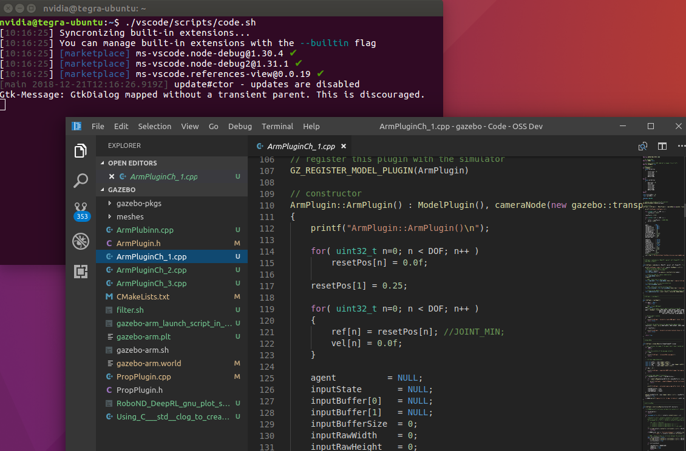
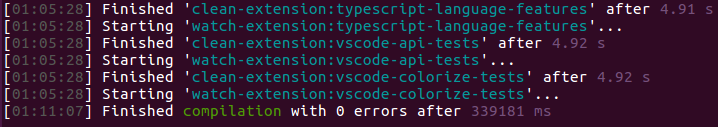
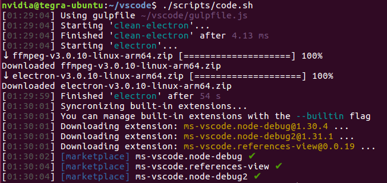

# Install VScode on Nvidia TX2

VScode is a nice IDE for developers. It is widely used and has many features.
Even so, I struggled trying to install it, using many different solutions found in the internet.

Finally, after many searches and tries, I had success to build and install VScode in my NVidia TX2 and decided to document and share my experience. Fell free to share this document.



Here are the steps I used.

### 1. You need install some packages

```bash
~$ sudo apt install git libx11-dev libxkbfile-dev libsecret-1-dev fakeroot rpm libnss3 apt-transport-https
```

### 2. Install nodejs 10.19

```bash
~$ curl -sL https://deb.nodesource.com/setup_10.x | sudo -E bash -
~$ sudo apt install -y nodejs

# Check if nodejs installation is ok using the command
~$ nodejs -v
```

### 3. Maybe you need some additional addons: gcc, g++, make

```bash
~$ sudo apt install gcc g++ make
```

### 4. Install Yarn package manager

```bash
~$ curl -sL https://dl.yarnpkg.com/debian/pubkey.gpg | sudo apt-key add -
~$ echo "deb https://dl.yarnpkg.com/debian/ stable main" | sudo tee /etc/apt/sources.list.d/yarn.list
~$ sudo apt update
~$ sudo apt install yarn

# check if yarn installation is ok using the command
~$ yarn --version
```

### 5. Now clone the Microsoft VS code repository

```bash
~$ git clone https://github.com/microsoft/vscode
~$ cd vscode
```

### 6. Install dependencies using yarn tool

```bash
~$ yarn
```

### 7. Now build vscode

```bash
~$ yarn run watch

# after build you will get something like this
```



### 8. Launch VScode and voila!

```bash
~$ ./scripts/code.sh
```



### You will find some interesting comments in [Nvidia forum](https://devtalk.nvidia.com/default/topic/1035752/how-to-install-quot-visual-studio-code-quot-/)
Enjoy!
